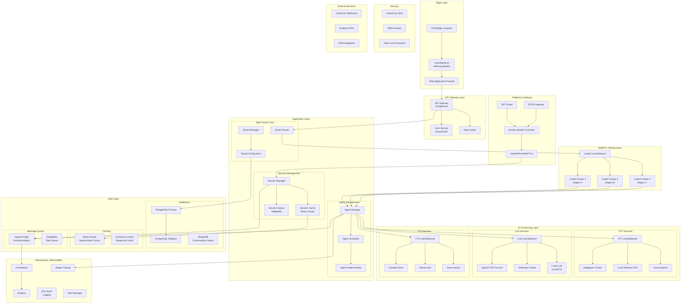

# Enterprise AI Voice Platform Architecture

## System Requirements
- **Scale**: 10,000 concurrent calls
- **Latency**: <1.5 seconds end-to-end
- **Channels**: Telephony (SIP/PSTN) + Web (WebRTC)
- **Multi-tenant**: Isolated environments per customer
- **Security**: Enterprise-grade authentication & encryption
- **Observability**: Comprehensive monitoring & analytics

## High-Level Architecture



## Detailed Component Architecture

### 1. Traffic Distribution & Scaling Strategy

#### Load Balancing Configuration
```yaml
# HAProxy Configuration
global
    maxconn 50000
    
defaults
    mode http
    timeout connect 5s
    timeout client 30s
    timeout server 30s

frontend api_frontend
    bind *:443 ssl crt /etc/ssl/certs/
    maxconn 20000
    
    # Route telephony traffic
    acl is_sip path_beg /sip
    use_backend sip_backend if is_sip
    
    # Route WebRTC traffic
    acl is_webrtc path_beg /rtc
    use_backend webrtc_backend if is_webrtc
    
    default_backend api_backend

backend webrtc_backend
    balance leastconn
    option httpchk GET /health
    server livekit1 10.0.1.10:7880 check maxconn 2000
    server livekit2 10.0.1.11:7880 check maxconn 2000
    server livekit3 10.0.1.12:7880 check maxconn 2000

backend sip_backend
    balance leastconn
    server asterisk1 10.0.2.10:5060 check maxconn 2000
    server asterisk2 10.0.2.11:5060 check maxconn 2000
```

### 2. Multi-Tenant Architecture

#### Tenant Isolation Strategy
```python
# Tenant Configuration Model
class TenantConfig:
    def __init__(self, tenant_id: str):
        self.tenant_id = tenant_id
        self.ai_config = self._load_ai_config()
        self.limits = self._load_limits()
        self.security = self._load_security_config()
    
    def _load_ai_config(self):
        return {
            'stt_provider': 'deepgram',  # per-tenant preference
            'llm_model': 'gpt-4o-mini',
            'tts_provider': 'cartesia',
            'voice_id': 'sonic-english',
            'system_prompt': self._get_custom_prompt(),
            'response_timeout': 1200,  # 1.2s max
        }
    
    def _load_limits(self):
        return {
            'max_concurrent_calls': 500,
            'rate_limit_per_minute': 1000,
            'storage_quota_gb': 100,
            'retention_days': 90
        }
```

#### Tenant Router Implementation
```python
class TenantRouter:
    def __init__(self):
        self.tenant_configs = {}
        self.load_balancer = TenantLoadBalancer()
    
    async def route_call(self, call_request):
        tenant_id = self._extract_tenant(call_request)
        config = self.tenant_configs[tenant_id]
        
        # Check limits
        if not self._check_limits(tenant_id):
            raise TenantLimitExceeded()
        
        # Route to appropriate infrastructure
        if call_request.channel == 'sip':
            return await self._route_sip_call(call_request, config)
        elif call_request.channel == 'webrtc':
            return await self._route_webrtc_call(call_request, config)
```

### 3. Ultra-Low Latency AI Pipeline

#### Optimized Processing Chain
```python
class UltraLowLatencyProcessor:
    def __init__(self, tenant_config):
        self.tenant_config = tenant_config
        self.stt_service = self._init_stt()
        self.llm_service = self._init_llm()
        self.tts_service = self._init_tts()
        
        # Concurrent processing pools
        self.stt_pool = asyncio.Semaphore(100)
        self.llm_pool = asyncio.Semaphore(50)
        self.tts_pool = asyncio.Semaphore(100)
    
    async def process_audio_stream(self, audio_stream):
        start_time = time.time()
        
        # Pipeline stages with overlap
        async with asyncio.TaskGroup() as tg:
            # STT with streaming
            stt_task = tg.create_task(
                self._streaming_stt(audio_stream)
            )
            
            # Pre-warm LLM connection
            llm_warmup = tg.create_task(
                self._warmup_llm()
            )
        
        # Process as soon as we have partial text
        async for partial_text in stt_task.result():
            if self._is_complete_thought(partial_text):
                # Start LLM processing immediately
                response_task = asyncio.create_task(
                    self._streaming_llm(partial_text)
                )
                
                # Stream to TTS as tokens arrive
                async for token in response_task:
                    if self._is_sentence_boundary(token):
                        tts_task = asyncio.create_task(
                            self._streaming_tts(token)
                        )
        
        total_latency = time.time() - start_time
        if total_latency > 1.5:
            logger.warning(f"Latency target missed: {total_latency}s")
```

### 4. Telephony Integration

#### SIP/PSTN Gateway Configuration
```python
# Asterisk Integration
class TelephonyGateway:
    def __init__(self):
        self.asterisk_ari = ARIClient()
        self.session_manager = SessionManager()
    
    async def handle_inbound_call(self, channel):
        # Extract tenant from DID or ANI
        tenant_id = self._extract_tenant_from_did(channel.caller_id)
        
        # Create WebRTC bridge
        bridge = await self.asterisk_ari.bridges.create(type='mixing')
        await bridge.addChannel(channel=channel.id)
        
        # Create LiveKit room for AI processing
        room = await self._create_livekit_room(tenant_id)
        
        # Bridge audio between Asterisk and LiveKit
        await self._setup_audio_bridge(bridge, room)
    
    async def handle_outbound_call(self, call_request):
        # Initiate call through SIP trunk
        channel = await self.asterisk_ari.channels.originate(
            endpoint=f"SIP/{call_request.destination}",
            app="voice_ai",
            appArgs=f"tenant={call_request.tenant_id}"
        )
        return channel
```

### 5. Security Implementation

#### Zero-Trust Security Model
```python
class SecurityLayer:
    def __init__(self):
        self.vault_client = VaultClient()
        self.auth_service = AuthService()
        self.encryption = EncryptionService()
    
    async def authenticate_request(self, request):
        # Multi-factor authentication
        token = request.headers.get('Authorization')
        tenant_id = request.headers.get('X-Tenant-ID')
        
        # Validate JWT token
        claims = await self.auth_service.verify_jwt(token)
        
        # Check tenant permissions
        permissions = await self.auth_service.get_permissions(
            claims['sub'], tenant_id
        )
        
        # Rate limiting per tenant
        await self._check_rate_limits(tenant_id, claims['sub'])
        
        return AuthContext(claims, permissions, tenant_id)
    
    async def encrypt_audio_stream(self, audio_data, tenant_id):
        # Per-tenant encryption keys
        key = await self.vault_client.get_encryption_key(tenant_id)
        return await self.encryption.encrypt_stream(audio_data, key)
```

### 6. Observability & Monitoring

#### Comprehensive Monitoring Stack
```python
# Metrics Collection
class MetricsCollector:
    def __init__(self):
        self.prometheus = PrometheusClient()
        self.jaeger = JaegerTracer()
        
    @trace_span("ai_processing")
    async def track_processing_latency(self, operation):
        start_time = time.time()
        
        with self.prometheus.timer('ai_processing_duration'):
            result = await operation()
        
        latency = time.time() - start_time
        
        # Track SLA compliance
        self.prometheus.increment('sla_compliance', 
            {'met': latency < 1.5})
        
        # Real-time alerting
        if latency > 1.5:
            await self._send_alert(f"Latency SLA missed: {latency}s")
        
        return result
```

#### Key Metrics to Monitor
```yaml
# Prometheus Metrics Configuration
metrics:
  # Performance Metrics
  - ai_processing_duration_seconds
  - call_setup_duration_seconds  
  - concurrent_calls_total
  - sla_compliance_ratio
  
  # Resource Metrics  
  - cpu_usage_percent
  - memory_usage_bytes
  - gpu_utilization_percent
  - network_bandwidth_mbps
  
  # Business Metrics
  - calls_per_tenant_per_minute
  - revenue_per_call
  - customer_satisfaction_score
  - error_rate_by_tenant

  # Security Metrics
  - authentication_failures_total
  - rate_limit_violations_total
  - encryption_key_rotations_total
```

## Infrastructure Scaling Plan

### Phase 1: Foundation (0-1K calls)
- **WebRTC**: 3 LiveKit nodes (HA setup)
- **Telephony**: 2 Asterisk servers
- **AI**: Shared GPU cluster (4x A100)
- **Database**: PostgreSQL primary + 2 replicas
- **Cache**: 3-node Redis cluster

### Phase 2: Scale-Out (1K-5K calls)
- **WebRTC**: Auto-scaling LiveKit (3-10 nodes)
- **Telephony**: 4 Asterisk servers + SBC cluster
- **AI**: Dedicated GPU clusters per service
- **Database**: Sharded PostgreSQL + read replicas
- **Cache**: 6-node Redis cluster + distributed cache

### Phase 3: Hyperscale (5K-10K calls)
- **WebRTC**: Multi-region LiveKit deployment
- **Telephony**: Carrier-grade SBC with geographic distribution
- **AI**: Edge AI deployment + centralized fallback
- **Database**: Distributed PostgreSQL (Citus/CockroachDB)
- **Cache**: Global Redis cluster with regional nodes

## Cost Optimization Strategy

### Resource Allocation
```yaml
# Kubernetes Resource Configuration
apiVersion: apps/v1
kind: Deployment
metadata:
  name: ai-agent-processor
spec:
  replicas: 20
  template:
    spec:
      containers:
      - name: agent
        resources:
          requests:
            cpu: "2"
            memory: "4Gi" 
            nvidia.com/gpu: "0.5"  # GPU sharing
          limits:
            cpu: "4"
            memory: "8Gi"
            nvidia.com/gpu: "1"
      
      # Horizontal Pod Autoscaler
      - name: hpa-config
        targetCPUUtilizationPercentage: 70
        minReplicas: 10
        maxReplicas: 100
```

### Estimated Infrastructure Costs (10K concurrent calls)

| Component | Monthly Cost | Notes |
|-----------|-------------|--------|
| Compute (GPU) | $15,000 | 40x A100 GPUs for AI processing |
| Compute (CPU) | $8,000 | 200 CPU cores for orchestration |
| Database | $3,000 | Managed PostgreSQL + MongoDB |
| Cache/Queue | $2,000 | Redis Cluster + RabbitMQ |
| Networking | $5,000 | CDN + Load Balancers |
| Monitoring | $1,500 | Prometheus + Grafana + Jaeger |
| Security | $2,500 | WAF + Vault + SIEM |
| **Total** | **$37,000** | ~$0.11 per concurrent call |

## Deployment Architecture

This architecture enables:
- **Linear scaling**: Each component scales independently
- **Sub-1.5s latency**: Through streaming, caching, and edge deployment
- **99.9% uptime**: Multi-region redundancy and auto-failover
- **Enterprise security**: Zero-trust model with end-to-end encryption
- **Cost efficiency**: GPU sharing and auto-scaling
- **Multi-tenancy**: Complete isolation with shared infrastructure

Would you like me to elaborate on any specific component or provide implementation details for particular aspects of this architecture?